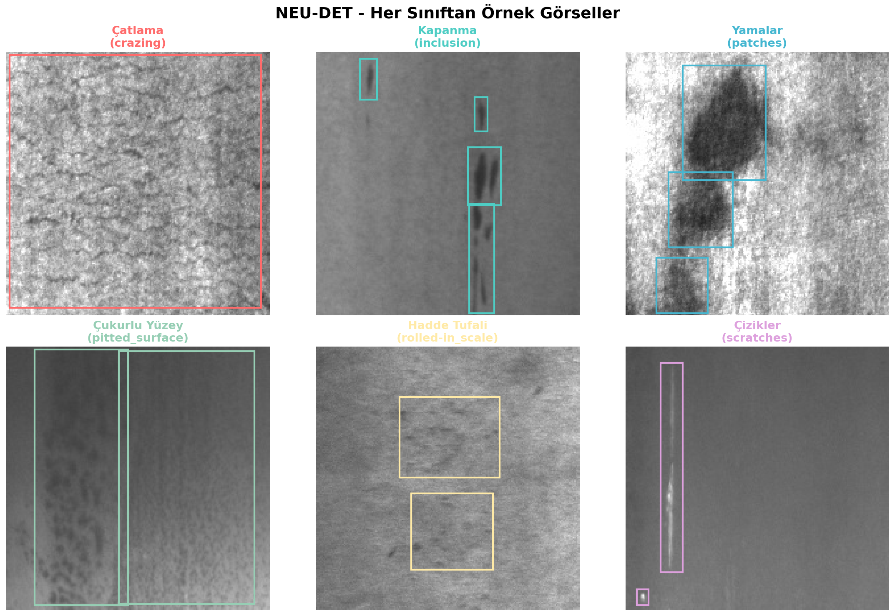
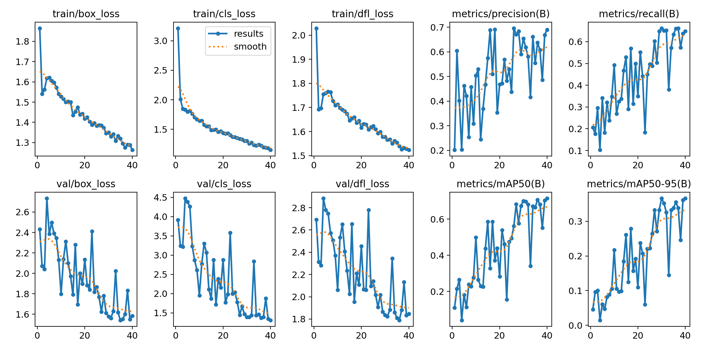
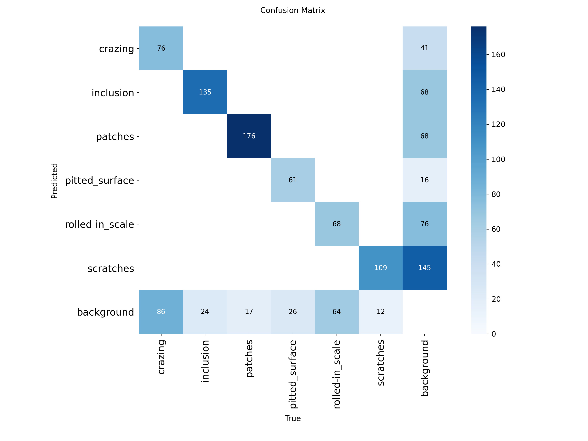
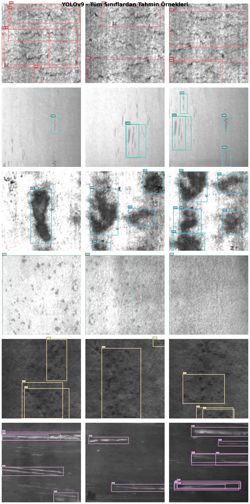

🇹🇷 **Türkçe** · [🇬🇧 English](README.md)

# Çelik Yüzey Hatası Tespiti

Sıcak haddelenmiş çelik şeritte altı sınıf yüzey hatasını tespit eden YOLOv9
modeli. Açık **NEU Surface Defect Database** üzerinde transfer öğrenmeyle
eğitildi.

Entegre bir demir-çelik tesisinde, yaz stajı kapsamında ana takip çalışmasının
yanında yürütülen bir inceleme projesi.

> Bu proje yalnızca **açık akademik veri seti** kullanır — tesis görüntüsü
> içermez, dolayısıyla burada gizlenen hiçbir şey yoktur.

---

## Veri seti

| | |
|---|---|
| Kaynak | NEU Surface Defect Database |
| Görüntü | 1.800 (1.440 eğitim / 360 doğrulama) |
| Çözünürlük | 200×200 px, gri tonlama (modele 640'a ölçeklenir) |
| Sınıf | 6 |



| Sınıf | Türkçe | Açıklama |
|-------|--------|----------|
| `crazing` | Çatlama | Yüzeyde ağ şeklinde ince çatlaklar |
| `inclusion` | Kapanma | Metalik olmayan kalıntılar, yabancı cisim |
| `patches` | Yamalar | Düzensiz renk değişimleri |
| `pitted_surface` | Çukurlu yüzey | Yüzeydeki küçük çukurcuklar |
| `rolled-in_scale` | Hadde tufali | Haddeleme sırasında gömülen oksit tabakası |
| `scratches` | Çizikler | Doğrusal çizik izleri |

Etiketler PASCAL VOC XML biçiminde geliyor; `convert_voc_to_yolo.py` mutlak
piksel koordinatlarını normalize edilmiş YOLO koordinatlarına çeviriyor.
Dönüşümün doğruluğu, çevrilen kutuların rastgele görüntülere geri çizilmesiyle
denetlendi.

## Eğitim

COCO üzerinde önceden eğitilmiş ağırlıklardan başlatılan YOLOv9c — 1.800
görüntüyü yeterli kılan şey transfer öğrenme. Kaynak görüntüler 200×200 olsa da
girdi 640'a ölçekleniyor ki önceden eğitilmiş ağırlıklar beklediği ölçeği
görsün.



## Sonuçlar

| Metrik | Değer |
|--------|-------|
| mAP@0.5 | **0,702** |
| mAP@0.5:0.95 | 0,367 |
| Precision | 0,661 |
| Recall | 0,663 |
| F1 | 0,662 |

Sınıf bazında:

| Sınıf | Precision | Recall | mAP@0.5 |
|-------|-----------|--------|---------|
| patches | 0,741 | 0,891 | **0,899** |
| inclusion | 0,715 | 0,774 | 0,836 |
| pitted_surface | 0,847 | 0,690 | 0,797 |
| scratches | 0,517 | 0,868 | 0,783 |
| crazing | 0,675 | 0,377 | 0,503 |
| rolled-in_scale | 0,471 | 0,379 | **0,395** |



Buradaki asıl hikâye zayıf sınıflar. `crazing` ile `rolled-in_scale` birbirine
benziyor — düşük kontrastta ince yüzey dokusu — ve karışıklık matrisi ikisinin
birbirinin yerine geçtiğini gösteriyor. İkisi de model kapasitesinden çok daha
yüksek kontrastlı görüntülemeden fayda görür.



## Depo yapısı

| Dosya | İşlevi |
|-------|--------|
| `convert_voc_to_yolo.py` | PASCAL VOC XML → YOLO etiket biçimi |
| `visualize_dataset.py` | Sınıf dağılımı, kutu boyut analizi, etiket bindirmeleri |
| `train.py` | Eğitim giriş noktası |
| `evaluate.py` | Doğrulama metrikleri, karışıklık matrisi, PR/F1 eğrileri |
| `predict.py` | Yeni görüntülerde çıkarım |
| `app.py` | Gradio demo arayüzü |

## Çalıştırma

```bash
python -m venv venv && venv/bin/pip install -r requirements.txt
python convert_voc_to_yolo.py
python train.py
python evaluate.py
python app.py          # Gradio demo
```

Kod yorumları Türkçe, belgelendirme iki dilde.
